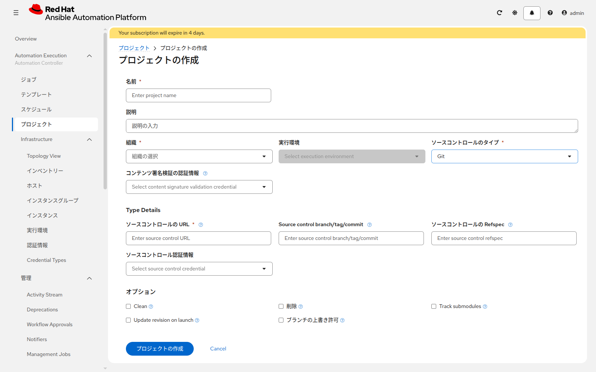

# 演習 4 - AWSでサーバを作る

[演習3](./ex3.md) | [ホスト登録へ戻る](./ex3.md#add-hosts)

> **前提:** [演習2](./ex2.md) の AWS 用と GitLab 用の認証情報、[演習3](./ex3.md) Section 3 の `<name_prefix>-aws-runner`

対象の Linux と Windows がすでにある場合は、この演習を全部飛ばして [演習5](../basic-controller/ex5.md) へ進んでください。

この演習は、AWS に次を作ります。同じアカウントに他のリソースがあっても、接頭辞で分かれます。

* VPC、サブネット、インターネットゲートウェイ、ルートテーブル、セキュリティグループ
* Linux 1台（SSH、ユーザー `ansible`）
* Windows 1台（PSRP、NTLM、ユーザー `Administrator`）

名前には、演習1で決めた接頭辞を `resource_prefix` として付けます。同じアカウントを複数人で使うときに、リソースが混ざらないようにするためです。作ったサーバのアドレスはログに出るので控えます。

ジョブは数分で終わります。Windows の起動が遅いときは、PSRP の待ち受けが開くまで待つため、15分ほどかかることがあります。

パスワードは、このあと Extra variables に自分で入れる値です。テンプレートの **詳細** を初期値の `0 (正常)` のまま起動すれば、タスクの出力には、パスワードそのものは出ません。ジョブの詳細の Extra variables と、ジョブテンプレートの Extra variables には、入れた値が平文で残ります。この演習のサーバ専用の値にして、本番で使っているパスワードは入れないでください。ジョブテンプレートに残った値は、Section 3 の最後で消します。実際の運用で起動のたびに秘密の値を渡すときは、Survey の Answer type を Password にします。入れた値は、ジョブの詳細には平文で残りません。作り方は [演習8](../basic-controller/ex8.md) です。

開始前に、[演習3](./ex3.md) の Section 3 まで終わっていることを確認します。ジョブテンプレートのインベントリー欄では、そこで作った `<name_prefix>-aws-runner` を選びます。この演習でインベントリーは作りません。

## Section 1: PlaybookをGitLabに置く

ここでは、サーバ作成に必要なファイルだけ先に置きます。残りのファイルは [演習5](../basic-controller/ex5.md) で同じ画面に足します。

1. GitLab で **Create new…** > **New project/repository** > **Create blank project** を開く
2. Project name は `<name_prefix>-aap-training-content`、Visibility は `Private`。README の初期化は付けたままにする


3. 右上の **Code** を開き、**Web IDE** をクリックする。メニュー名が **Edit** の環境では、その中の **Web IDE** を選ぶ


4. 次の4ファイルを作り、[sample-content/](../sample-content/) の内容を貼り付ける
   * `create_aws_servers.yml`
   * `remove_aws_servers.yml`
   * `requirements.yml`
   * `group_vars/all.yml`
5. **Source Control** から **Commit to main** をクリックする
6. プロジェクトの画面に戻り、右上の **Code** を開いて、**Clone with HTTPS** の URL を控える。Section 2 で使う

`requirements.yml` は、ジョブが使う `amazon.aws` の版を 10.3.0 に固定するファイルです。AWS で作る場合だけ置きます。置かないとジョブが失敗します。

`group_vars/all.yml` の `allow_cidr` は `0.0.0.0/0` です。作ったサーバの SSH（TCP 22）と PSRP（TCP 5985）を、どの接続元からも許可します。この演習では、この値のまま使います。実際の運用では、接続してくるアドレスだけを書きます。学習が終わったら、Section 5 でサーバを消します。

<details>
<summary>git CLIで行う場合</summary>

```bash
git clone https://gitlab.example.local/<namespace>/<name_prefix>-aap-training-content.git
cd <name_prefix>-aap-training-content
# 上の4ファイルだけをコピーする
git add create_aws_servers.yml remove_aws_servers.yml requirements.yml group_vars/all.yml
git commit -m "Add AWS server creation playbooks"
git push
```

</details>

## Section 2: AAPにプロジェクトを登録する

**Automation Execution > プロジェクト** を開き、**プロジェクトの作成** をクリックします。



| 項目 | 入力値 |
|---|---|
| 名前 | `<name_prefix>-aap-training-content` |
| ソースコントロールタイプ | Git |
| ソースコントロールURL | Section 1 で控えた **Clone with HTTPS** の URL |
| ソースコントロールブランチ | `main` |
| ソースコントロール認証情報 | `<name_prefix>-gitlab-scm` |
| 起動時のリビジョン更新 | 有効 |
| クリーン | 有効 |

保存したあと、同期を実行し、成功することを確認します。失敗したら URL、ユーザー名、パスワード、ブランチ名を見直してください。

## Section 3: ジョブテンプレートを作って実行する

**Automation Execution > テンプレート** を開き、**テンプレートの作成** > **ジョブテンプレートの作成** をクリックします。


| 項目 | 入力値 |
|---|---|
| 名前 | `<name_prefix>-create-aws-servers` |
| インベントリー | `<name_prefix>-aws-runner` |
| プロジェクト | `<name_prefix>-aap-training-content` |
| Playbook | `create_aws_servers.yml` |
| 実行環境 | 空欄（既定のまま） |
| 認証情報 | `<name_prefix>-aws-training` だけ。Machine は付けない |
| Extra variables | 下の YAML |

```yaml
resource_prefix: tanaka01
linux_login_password: <Linuxのパスワード>
windows_login_password: <Windowsのパスワード>
```

`tanaka01` は例です。演習1で決めた接頭辞と同じ文字列にします。`<Linuxのパスワード>` と `<Windowsのパスワード>` は、自分で決めた値に置き換えます。`<` と `>` は残しません。パスワードの条件は次のとおりです。条件に合わないと、最初のタスク `Required variables are set` で止まります。

* 英数字だけで、8文字以上32文字以内
* 英大文字、英小文字、数字を、それぞれ1文字以上含む（Windows は、この3種類が無いパスワードを設定できません）

実行環境は空欄のままにします。Playbook は、システムの既定の実行環境の中で動きます。説明は [AAPのしくみ](../aap_overview.md) に書いてあります。

リージョンは `group_vars/all.yml` の `ap-northeast-1` のままにします。この演習では変えません。Extra variables に入れるのは、上の3行だけです。

**テンプレートの起動** をクリックします。成功すると、最後のタスクに次のような行が出ます。

```
resource_prefix: tanaka01
Linuxの名前: tanaka01-linux
Linuxの接続先: 203.0.113.10
Linuxのユーザー: ansible
Windowsの名前: tanaka01-windows
Windowsの接続先: 203.0.113.11
Windowsのユーザー: Administrator
パスワードは、このジョブの Extra variables に入れた値です。
```

`tanaka01`、`203.0.113.10`、`203.0.113.11` は例です。ログに出た2つのアドレスと、ユーザー名を控えます。パスワードは、Extra variables に入れた2つの値です。ジョブの詳細を開くと、その値が Extra variables に残っています。

値を控えたら、`<name_prefix>-create-aws-servers` の **テンプレートの編集** を開き、Extra variables から `linux_login_password` と `windows_login_password` の2行を消して保存します。`resource_prefix` の行は残します。テンプレートを開ける他の人に、パスワードが見えないようにするためです。もう一度このジョブを起動するときは、2行を入れ直します。

失敗したときは、失敗したタスクの `msg` を見ます。よくある原因は、`resource_prefix` の文字種、パスワードの条件（記号が入っている、英大文字・英小文字・数字のどれかが無い）、AWS のキーに EC2 の作成権限が無いこと、VPC の数がアカウントの上限（初期値はリージョンあたり5つ）に達していることです。VPC の上限に達したときは、講師に連絡します。

## Section 4: ログイン用の認証情報を作る

[演習2](./ex2.md) と同じ作成画面で、Machine 認証情報を2つ作ります。

| 名前 | ユーザ名 | パスワード |
|---|---|---|
| `<name_prefix>-linux-ssh` | `ansible` | `linux_login_password` に入れた値 |
| `<name_prefix>-windows-psrp` | `Administrator` | `windows_login_password` に入れた値 |

**Privilege Escalation Method** は空欄です。

## Section 5: 不要になったら削除する

リソースを残すと課金が続きます。学習が終わったら、同じ要領でジョブテンプレート `<name_prefix>-remove-aws-servers` を作り、Playbook を `remove_aws_servers.yml` にして実行します。Extra variables の `resource_prefix` は作成時と同じ値にします。パスワードは不要です。認証情報は `<name_prefix>-aws-training`、インベントリー欄は `<name_prefix>-aws-runner` です。

## 次

[演習3の Section 4](./ex3.md#add-hosts) に戻り、控えたアドレスを `lin1` と `win1` として登録し、疎通まで確認します。そのあと [演習5](../basic-controller/ex5.md) です。
